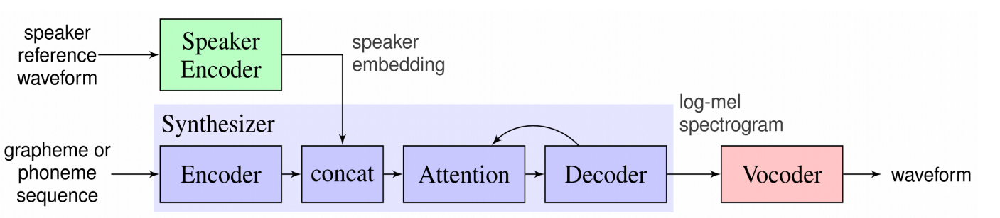

# 大致结构

分技术介绍，每个技术有对应的时间线。

## **引言（Introduction）**

- **背景介绍**：简要介绍语音克隆的背景和语音克隆是直观理解是什么，为什么它是一个重要的研究领域。例如，语音克隆技术可以应用于个性化语音生成、智能语音助手、语音合成等多个领域  。
- **定义和目标**：明确什么是语音克隆，和传统的TTS（文本到语音）系统有何区别。简述语音克隆的核心目标，即模仿特定说话人的语音。
- **综述目的**：阐明本文的目的和结构，说明综述将会涵盖的关键问题和技术。

---

## **语音克隆的基本概念和关键技术（main）（Fundamentals and Key Technologies）**

### 基本概念

- **语音克隆概述**：简要描述语音克隆的工作原理，强调语音克隆的核心任务是从少量数据或一个样本中生成目标说话人的语音。
- **传统TTS与语音克隆的区别**：
- 传统TTS系统生成标准化语音，语音克隆能根据特定说话人的特征生成个性化语音。
- 传统方法中需要大量的训练数据，语音克隆通过嵌入技术（如Speaker embedding）可以在少样本条件下实现。
  
### 步骤

- **特征提取（Speaker Embedding）**：详细讨论音色特征提取技术及其重要性，解释如何将说话人的音色（如音高、语速、情感等）转化为一个固定维度的嵌入向量。涵盖技术如 **x-vector**、**i-vector** 等。
- **语音生成**：
- 传统方法：如基于隐马尔可夫模型（HMM）的语音合成。
- 现代方法：介绍**深度神经网络（DNN）**、**WaveNet**、**Tacotron 2**、**FastSpeech** 等现代神经网络架构，讨论它们如何实现从文本到个性化语音的生成。

---

## **3. 语音克隆的主要方法（Main Approaches to Voice Cloning）**

### **早期语音合成方法与语音克隆的联系**

语音克隆（个性化语音合成）= 语音合成+说话人特征提取
有说话人编码和说话人自适应两种方法（基于音色一致的语音克隆说话人特征提取方法_李嘉欣，语音合成技术综述及研究现状_魏伟华）

### 语音合成方法

共振峰合成：不同的音色有不同的共振峰，提取频率和带宽参数
波形拼接：语音单元做变频等处理后重叠相加，类似vocal void术力口
谐波加噪声：信号分成谐波加噪声，在合成时进行高低频分离处理
（语音合成技术综述及研究现状_魏伟华，基于深度学习的中文个性化语音合成研究，A Survey on Neural Speech Synthesis_微软）

### **深度学习的理论**

- **深度神经网络（DNN）在语音克隆中的应用**
讲解 DNN 如何对提取的语音声学特征进行建模与学习，以实现语音特征的映射与重构。
举例说明一些基于 DNN 的语音克隆研究成果，分析其在语音相似度、自然度等方面的表现。
- **循环神经网络（RNN）及其变体**
介绍 RNN 在处理语音序列数据方面的优势，如能够捕捉语音的时序信息。
重点阐述长短期记忆网络（LSTM）和门控循环单元（GRU）在语音克隆中的应用，包括其网络结构、记忆单元的工作原理以及在改善语音生成效果方面的作用。
结合实际研究案例，对比不同 RNN 变体在语音克隆任务中的性能差异。
- **卷积神经网络（CNN）与语音克隆**
说明 CNN 在语音克隆中的应用场景，如对语音频谱图像的处理，提取局部特征等。
介绍 CNN 与其他神经网络（如 RNN）结合的模型架构在语音克隆中的优势与创新点，通过实例展示其在提升语音克隆质量方面的效果。
- **生成对抗网络（GAN）在语音克隆中的应用 声码器**
解释 GAN 的基本原理，包括生成器和判别器的作用与相互关系。
阐述如何将 GAN 应用于语音克隆领域，以提高生成语音的真实性和多样性，如通过对抗训练使生成语音更难以被判别器区分于真实语音。
分析基于 GAN 的语音克隆模型面临的挑战，如训练稳定性、模式崩溃等问题，并介绍当前的解决方法与研究进展。

---

### 语料处理 预处理

- 
- **ASR 自动分割标文字** Speaker-Attributed Training for Multi-Speaker Speech Recognition Using Multi-Stage Encoders and Attention-Weighted Speaker Embedding
- **语音分割** Advances in Computational Collective Intelligence: 16th International Conference, ICCCI 2024, Leipzig, Germany, September 9–11, 2024, Proceedings, Part II

---

### **合成器模型发展历程**

以下是语音合成技术领域的一些核心进展和模型的概述：

1. **Tacotron模型**：
   - Graves等人提出的Tacotron模型，使用序列到序列模型和注意力机制生成频谱。
   - 结合CBHG（Convolutional Bank with Highway Networks and Gated Recurrent Unit）提取高层次特征。

2. **Tacotron2模型**：
   - Shen等人基于Tacotron进行改进，提出Tacotron2。
   - 使用长短时记忆网络（LSTM）和卷积层代替CBHG，减少丢音概率。
   - Natural TTS Synthesis by Conditioning WaveNet on Mel Spectrogram Predictions

3. **Transformer模型**：
   - Vaswani等人提出Transformer模型，使用自注意力机制替代循环神经网络（RNN）或卷积神经网络（CNN）。
   - Transformer提高了并行效率和减少了计算量。

4. **TransformerTTS模型**：
   - Li等人将Transformer应用于语音合成，提出TransformerTTS模型。
   - 解决了Tacotron2难以建模长序列依赖关系的问题。

5. **Wave net模型**：
   - 一种用于生成原始音频波形的新型深度神经网络模型。
   - 完全基于概率论和自回归，每个音频样本的预测分布都取决于之前所有的样本。

6. **DeepVoice模型**：
   - Arik等人提出DeepVoice模型，是一个完全由深度神经网络构建的生产级TTS，为端到端的合成提供了基础。
   - 由五个模块组成：定位音素边界的分段模型、字-音转换模型、音素持续时间预测模型、基频预测模型、音频合成模型。将所有组件替换为神经网络，并先将文本转换为音素，再用音频合成模型将语言特征转换为语音。
   - Deep voice是完全独立的，不需要预先存在的TTS系统。使用 one-hot 编码的字符进行字符到音素转换，one-hot 编码的音素和重音，以毫秒为单位的音素持续时间，以及可以通过任何 F0 估计算法从波形中计算出的归一化对数基频。所有这些都可以轻松地从音频和转录中获得，相比其他模型更加简洁高效。

7. **DeepVoice2模型**：
   - 从单个模型中生成不同声音。
   - 基于与 Deep Voice 1 相似的流程，但使用更高性能的构建模块，我们通过引入后处理神经声码器改进了 Tacotron，有了显著的音频质量提升。
   - Deep Voice 2 和 Deep Voice 1 之间的主要区别是音素持续时间和频率模型的分离。Deep Voice 1 有一个单独的模型来共同预测音素持续时间和频率特征。在 Deep Voice 2 中，首先预测音素持续时间，然后将其用作频率模型的输入。

8. **FastSpeech模型**：
   - Ren等人提出FastSpeech模型，采用Transformer的前馈网络并行生成梅尔频谱图。
   - 解决了基于神经网络的端到端的TTS面临的三个问题：推理速度慢、合成语音通常鲁棒性差（即某些单词被跳过或重复）以及缺乏可控性（语音速度或韵律控制）
   - 引入持续时长预测器确保音素序列与频谱序列长度匹配，提高合成效率。与自回归 Transformer TTS 相比，我们的模型将梅尔频谱图生成速度提高了 270 倍，将端到端语音合成速度提高了 38 倍。

9. **FastSpeech模型**：
   - FastSpeech 存在一些缺点：从教师模型中提取的时长不够准确，并且从教师模型中提取的目标梅尔频谱图由于数据简化而存在信息损失，这都限制了语音质量。
   - 通过直接使用真实目标而不是教师输出的简化输出训练模型。引入更多语音变化信息（例如，音高、能量和更准确的时长）作为条件输入。解决了FastSpeech中的一些问题。

1. **多说话人语音合成系统**：
   - Park等人提出适用于多说话人的语音合成系统，并在实验中取得显著效果。

    （基于说话人特征双阶段迁移学习的情感语音克隆技术研究）
---

### 方法：说话人编码  编码器：音色嵌入 说话人模型构建 说话人识别

- i-vector Dehak等人提出，使用总变化空间（TVS）描述语音信息，定义说话人因子，用于说话人识别。
- d-vector 通过深度神经网络处理音频帧的说话人特征向量，网络最后一层输出累加并计算平均值得到的说话人模型表示。
- LDE-vector （Linear Discriminant Embedding vector）是在2017年左右由Yong Xu及其团队提出的。LDE-vector则主要依赖于传统的线性判别分析（LDA），适用于资源较为有限的情况，且能够提供较为清晰的数学解释。
- x-vector 由Daniel Povey教授（微软研究院）2018年提出的。他是著名开源语音识别工具Kaldi的主要维护者，被业界称为“Kaldi之父”。x-vector是第一个取得成功并被普遍应用的深度学习说话人识别方法，广泛应用于工业界。x-vector通过深度神经网络（DNN）将不定长的语音映射成定长的向量，这些向量称为x-vectors。
详细讨论如何通过 **Speaker Embedding**（如x-vector）技术提取说话人的个性化特征，并在TTS中实现音色控制。包括少样本学习（Few-shot learning）和一人样本学习（One-shot learning）的应用。

#### 新研究与改进

- 基于多参考音频和互信息（MI） MRMI-TTS: Multi-Reference Audios and Mutual Information Driven Zero-Shot Voice Cloning
- 重叠多说话人提取目标特征 Guided Speaker Embedding
- 改进算法 A real-time voice cloning system with multiple algorithms for speech quality improvement
- 使用未转录音频训练通用模型，将说话人特征映射后形成特征空间。找到最相似的模板库来模拟。Transfer Learning from Speaker Verification to Multispeaker Text-To-Speech Synthesis
- 架构改进？ Zero-Shot Voice Cloning Using Variational Embedding with Attention Mechanism
- 基于噪声等在一段语音中是局部变化的假设，提出了一种基于音色一致的音色约束损失 基于音色一致的语音克隆说话人特征提取方法

---

### 评价指标

- **主观评价指标**
介绍主观评价在语音克隆性能评估中的重要性，因为语音质量和相似度的主观感受对于实际应用至关重要。
详细说明常用的主观评价方法，如平均意见得分（MOS），包括评价标准、评价人员的选择与培训、评价实验的设计与实施等。
举例说明如何通过 MOS 评价不同语音克隆系统生成语音的自然度、相似度等方面的表现，并分析主观评价结果的可靠性与局限性。
- **客观评价指标**
阐述客观评价指标的作用，即通过量化的方式对语音克隆性能进行评估，为模型改进提供依据。
介绍常用的客观评价指标，如语音质量评估指标（如 PESQ、STOI 等）、语音相似度评估指标（如动态时间规整（DTW）距离、余弦相似度等）的计算方法与原理。
分析客观评价指标与主观评价结果之间的相关性与差异，说明如何综合运用主观和客观评价指标全面评估语音克隆系统的性能。

---

## **语音克隆的难点（Issues）**

- **数据需求与少样本学习**：讨论传统语音克隆方法对大量数据的需求，并探讨如何通过少样本学习（例如，一些方法能够从很少的数据中学习到音色特征）解决这一问题。
- **音色保持与自然度**：语音克隆不仅需要保持目标说话人的音色特征，还需要确保生成语音的自然度和流畅性。介绍如何通过多层次的特征学习、语音合成模型优化等手段来提升音质。
- **情感与语气的控制**：语音克隆需要模拟说话人的语气、情感等非语言信息，这也是一个挑战。讨论如何在语音生成中实现情感的模拟。
- **多说话人的语音克隆**：在多说话人环境下生成个性化语音的挑战。多说话人语音克隆涉及到如何高效地管理多个说话人音色特征的嵌入向量，以及如何确保不同说话人的语音质量。

---

## 语音克隆的应用（Applications of Voice Cloning）

- **个性化语音生成**：介绍语音克隆在个性化语音助手、电话客服、配音等领域的应用。
- **语音替代与恢复**：讨论语音克隆如何帮助失声患者恢复自己的声音，或者为没有足够数据的说话人生成个性化语音。
- **影视与娱乐行业**：在影视配音、游戏配音等领域中，语音克隆可以快速生成符合角色特征的语音。
- **其他**：语音客服，有声读物，视频配音，辅助语言学习。
- Speech synthesis with face embeddings

---

## 技术与限制

- 技术挑战：讨论数据质量、模型可扩展性和通用性等技术挑战。
- 伦理问题：关注隐私和伦理问题，如何在保护个人隐私的前提下合理利用语音数据。
- 数据隐私与安全

---

## 未来趋势与研究方向（Future Directions and Research Opportunities）

- **多模态语音克隆**：探索结合视觉、情感等信息的 **多模态语音克隆**，以实现更加真实和富有表现力的语音生成。
- **自适应语音克隆**：如何开发能够根据用户需求自适应调整音色、语调等特征的模型。
- **生成模型的优化与加速**：讨论如何提高模型的生成速度，降低计算复杂度，同时保持高质量输出。
- **更加高效的少样本学习**：如何提升少样本学习的能力，以适应实际应用中较少数据的情况。
- Speech synthesis with face embeddings
  
---

## 总结（Conclusion）

- 对语音克隆领域的最新进展进行总结，强调其技术革新、实际应用以及面临的挑战。
- 强调语音克隆的未来潜力，并对未来的研究方向进行展望。

---

## 参考文献（References）

- 列出所有引用的论文、书籍和资料。

---
