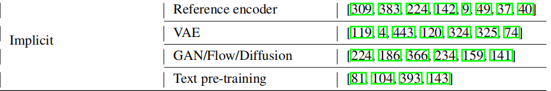
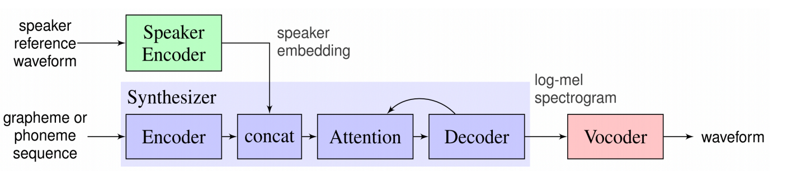

# voice cloning

## 基本介绍

### 背景介绍/引言

阐释这个研究方向的概况，热点话题，应用领域，研究背景等等。

### 定义（研究范围界定）

语音克隆指的是TTS领域实现适应不同speaker的技术领域，在学界和业界也被称为adaptive TTS、custom voice、personalized voice synthesis.
区别：在微软A Survey on Neural Speech Synthesis提到，voice clone主要是对说话人音色的适应的adaptive TTS：“Here we mainly discuss adaptive TTS for different voices, instead of languages, styles, domains, etc”。

#### 克隆目标

当向模型注入未见说话人的 acoustic prompt 或 speaker audio 时，语音克隆的主要目的是实现以下几个方面的克隆：

- (1) 音色（Timbre）
音色是说话人最核心的身份特征，决定了“是谁在说话”。
模型需要准确提取并复现目标说话人的音色特性。这包括了性别信息等。
- (2) 韵律（Prosody）
韵律包括语调、节奏、重音和停顿等，反映了说话人的语言习惯和情感表达。地区口音就在此列。
零样本TTS需要在生成新文本时保持与目标说话人一致的韵律模式。
- (3) 情感（Emotion）
如果 acoustic prompt 包含情感信息（如喜悦、悲伤或愤怒），模型应能捕捉并传递这些情感到合成语音中。
- (4) 声学环境（Acoustic Environment）
声学环境指的是录音背景中的噪声、混响或其他空间特性。
在某些应用场景中，模型可能需要保留或模拟目标说话人的原始声学环境。

我们接下来的讨论以音色Timbre的克隆为主。

### 大领域关联性

和TTS的关联（子问题）
和voice conversion的关联：voice conversion是音色替换，需要给到原音频。TTS中的语音解码器可以通过自回归摩尔谱图预测[52]进行预训练，或通过语音转换任务[440]进行联合训练。：low-resource expressive text-to-speech using data augmentation
和speaker verification：一篇大牛的论文复用verification任务来训练语音克隆的模型，也提出了SVTTS框架。
……

---

## 语音克隆的发展

### 语音合成

#### 语音合成的历史沿革

- 1.早期方法：
Articulatory Synthesis：通过模拟人类发音器官（如嘴唇、舌头、声带）的运动来生成语音。这种方法理论上最接近人类发音，但实现难度大，数据获取困难。
Formant Synthesis：基于规则的共振峰模型，通过控制共振峰和基频等参数生成语音。这种方法生成的语音可懂度高，但自然度较差。
Concatenative Synthesis：依赖于存储的语音单元（如单词或音节），通过拼接这些单元生成语音。这种方法生成的语音自然度高，但需要大量的录音数据，且难以控制语音的韵律和情感。
- 2.统计参数语音合成（SPSS）：
文本分析：将文本转换为语言特征，包括音素、时长、基频等。
声学模型：使用 HMM 或 DNN 模型预测声学特征（如梅尔倒谱系数、线性谱图等）。
声码器：将声学特征转换为波形，常用的声码器包括 STRAIGHT [155] 和 WORLD [238]。
改进：通过引入深度学习（如 DNN、RNN），提高了合成语音的自然度和可懂度。
- 3.神经网络语音合成（Neural TTS）：
文本分析：简化了文本分析模块，直接使用字符或音素作为输入。
声学模型：使用神经网络（如 Tacotron 1/2 [382, 303]、Deep Voice 3 [270]）生成梅尔谱图或其他声学特征。
声码器：使用神经声码器（如 WaveNet [254]、WaveRNN [150]）直接从声学特征生成波形。
改进：通过引入注意力机制和自注意力机制，进一步提高了合成语音的自然度和鲁棒性。
- 4.端到端语音合成：
直接从文本到波形：省去了中间的声学特征转换步骤，直接从文本生成波形。
代表性模型：WaveNet [254]、Tacotron 2 [303]、FastSpeech 1/2 [290, 292] 等。
改进：通过引入非自回归生成和并行生成技术，进一步提高了生成速度和效率。
- 5.完全端到端语音合成：
直接从文本到波形：进一步简化了模型结构，直接从文本生成波形，省去了中间的声学特征和梅尔谱图转换。
代表性模型：ClariNet [269]、FastSpeech 2s [292]、EATS [69] 等。
改进：通过引入更高效的生成模型和优化技术，进一步提高了生成速度和语音质量。

#### 语音克隆要做的

相比于语音合成，语音克隆要解决的是：对不同说话人的适应模拟（音色、风格、韵律、情感）、声学素材的处理（隐式素材无标签、素材不足等）。在此基础上尽可能实现语音合成的高质量。

---

### 语音克隆的方法

在语音克隆时，往往没有显式的数据标签可用，或者打标通常会导致大量的人力，不能覆盖特定的或细粒度的变化信息。因此，我们可以从数据中隐式地建模变异信息。各种处理方法如下：

**这些方法就是主要的实现语音克隆的方案?**

### 1. **fine-tune 微调**

粗略地说，更多的数据将导致更好的语音质量，但会产生较高的数据收集成本。对于自适应参数，整个TTS模型[44,177]，或部分模型（如解码器）[240,446]，或只有speaker embeddings[9,44,40]可以进行微调。类似地，微调更多的参数将导致良好的语音质量，但会增加内存和部署成本。在实践中，我们的目标是适应尽可能少的数据和参数，同时实现较高的自适应语音质量。

- **Chen 等人**的研究表明，使用目标说话人的少量数据（如数分钟的语音）对整个模型进行微调，可以有效复刻目标说话人的音色。他们尝试了不同微调策略，包括微调说话人嵌入特征、说话人编码器以及整个语音合成模型。
- **Moss 等人**提出的 **BOFFIN TTS** 系统在微调时固定了文本特征提取部分的参数，仅调整频谱参数合成部分的网络，从而减少了需要微调的参数量。
- **Arik 等人**则进一步简化了微调过程，仅微调说话人嵌入特征的参数。
- ****AdaSpeech** 在解码器中引入了**条件层归一化（Conditional Layer Normalization）**，利用说话人嵌入特征预测层归一化的平移因子和缩放因子。在进行目标说话人适应微调时，仅调整说话人嵌入特征和条件层归一化的参数。**

**改进点**：：这些方法通过减少微调的参数量，缓解了目标说话人数据短缺的问题。然而，微调过程仍然需要一定的数据量和计算资源，且微调步骤较为繁琐。

### 2. **SVTTS（speaker embedding）**

- **Deep Voice 2** 和 **Deep Voice 3** 是最早的基于深度学习的多说话人语音合成系统之一。它们使用**说话人嵌入特征（Speaker Embedding）**来表示不同说话人的音色。这些嵌入特征是模型的可学习参数，与整个语音合成网络一起训练。
- **改进点**：这些系统能够高质量地还原训练集中各个说话人的音色，但无法直接生成训练集中未出现过的说话人音色。为了生成新说话人的音色，通常需要对模型进行微调。
- **Jia 等人**(***被引千次，应该说语音克隆的主流方法就是这个了***)提出的 **SVTTS** 系统引入了**自适应的说话人编码器**，省去了微调步骤。该系统首先基于声纹识别任务训练一个说话人编码器，能够为任意音频生成说话人嵌入特征。在系统使用阶段，只需输入目标说话人的音频，即可生成目标说话人的嵌入特征，并将其输入到 **Tacotron2** 模型中生成目标音色的语音。合成器扩展了Tacotron 2架构，支持多说话人合成，通过将说话人嵌入向量引入合成过程。具体来说，在每个时间步，说话人嵌入向量与编码器输出（文本特征向量）进行拼接。这种组合后的特征向量随后被传递给注意力机制和合成器的后续层。
- **改进点**：SVTTS 的关键在于说话人编码器的泛化能力。通过使用 **GE2E 损失**，系统能够使不同说话人的嵌入特征在特征空间中尽量远离，而同一说话人的嵌入特征尽量接近，从而提高模型的泛化性。这种方法无需微调，能够通过少量目标说话人数据生成高质量的语音克隆。

### 3.audio codec

近年来，基于 Audio Codec 的方法逐渐成为语音克隆领域的一个新兴方向。这类方法通常先将原始音频编码为一系列离散的声学令牌（acoustic tokens），然后再利用这些令牌指导生成新的语音波形。这种方法的一个显著优势是可以更好地保留原始音频中的细微差别，从而提升克隆语音的真实感。

**Codec 的功能**：将连续的音频信号转换成离散的表征形式，便于后续处理。

**典型实现**：
VALLE（Vector-Quantized Autoregressive Language Model for Speech）就是一个典型的例子，它结合了自回归语言模型和量化矢量编码器，能够在较少参考音频的情况下实现高效的声音克隆13。

其他类似的模型还包括那些基于 Autoencoder 或 Variational Autoencoder 架构设计的 Codec，它们同样致力于学习高效的音频压缩与解压方式，进而服务于语音合成任务。

### 端到端模型

随着深度学习技术的发展，越来越多的研究开始探索完全端到端的语音克隆解决方案。这类模型试图直接从文本和参考音频出发，一步到位地生成最终的语音波形，避免了传统流水线式架构中存在的误差累积问题。

### 无监督学习与自监督学习

为了减少对标注数据的依赖，部分工作尝试采用无监督或自监督的方式训练语音克隆模型。例如，利用对比学习构建强大的声学特征提取器，或者借助生成对抗网络（GAN）增强生成语音的质量。

#### 其他方向的研究与改进

- 基于多参考音频和互信息（MI） MRMI-TTS: Multi-Reference Audios and Mutual Information Driven Zero-Shot Voice Cloning
- 重叠多说话人提取目标特征 Guided Speaker Embedding
- 改进算法 A real-time voice cloning system with multiple algorithms for speech quality improvement
- 使用未转录音频训练通用模型，将说话人特征映射后形成特征空间。找到最相似的模板库来模拟。Transfer Learning from Speaker Verification to Multispeaker Text-To-Speech Synthesis
- 架构改进？ Zero-Shot Voice Cloning Using Variational Embedding with Attention Mechanism
- 基于噪声等在一段语音中是局部变化的假设，提出了一种基于音色一致的音色约束损失 基于音色一致的语音克隆说话人特征提取方法

---

### 评价指标(这里想删掉不写)

- **主观评价指标**
介绍主观评价在语音克隆性能评估中的重要性，因为语音质量和相似度的主观感受对于实际应用至关重要。
详细说明常用的主观评价方法，如平均意见得分（MOS），包括评价标准、评价人员的选择与培训、评价实验的设计与实施等。
举例说明如何通过 MOS 评价不同语音克隆系统生成语音的自然度、相似度等方面的表现，并分析主观评价结果的可靠性与局限性。
- **客观评价指标**
阐述客观评价指标的作用，即通过量化的方式对语音克隆性能进行评估，为模型改进提供依据。
介绍常用的客观评价指标，如语音质量评估指标（如 PESQ、STOI 等）、语音相似度评估指标（如动态时间规整（DTW）距离、余弦相似度等）的计算方法与原理。
分析客观评价指标与主观评价结果之间的相关性与差异，说明如何综合运用主观和客观评价指标全面评估语音克隆系统的性能。

---

## **语音克隆的难点（Issues）/未来研究趋势**

- **数据需求与少样本学习**：讨论传统语音克隆方法对大量数据的需求，并探讨如何通过少样本学习（例如，一些方法能够从很少的数据中学习到音色特征）解决这一问题。
- **音色保持与自然度**：语音克隆不仅需要保持目标说话人的音色特征，还需要确保生成语音的自然度和流畅性。介绍如何通过多层次的特征学习、语音合成模型优化等手段来提升音质。
- **情感与语气的控制**：语音克隆需要模拟说话人的语气、情感等非语言信息，这也是一个挑战。讨论如何在语音生成中实现情感的模拟。
- **多说话人的语音克隆**：在多说话人环境下生成个性化语音的挑战。多说话人语音克隆涉及到如何高效地管理多个说话人音色特征的嵌入向量，以及如何确保不同说话人的语音质量。
- - **多模态语音克隆**：探索结合视觉、情感等信息的 **多模态语音克隆**，以实现更加真实和富有表现力的语音生成。
- **生成模型的优化与加速**：讨论如何提高模型的生成速度，降低计算复杂度，同时保持高质量输出。

---

## 语音克隆的应用（Applications of Voice Cloning）

- **个性化语音生成**：介绍语音克隆在个性化语音助手、电话客服、配音等领域的应用。
- **语音替代与恢复**：讨论语音克隆如何帮助失声患者恢复自己的声音，或者为没有足够数据的说话人生成个性化语音。
- **影视与娱乐行业**：在影视配音、游戏配音等领域中，语音克隆可以快速生成符合角色特征的语音。
- **其他**：语音客服，有声读物，视频配音，辅助语言学习。
- Speech synthesis with face embeddings

---

## 技术与限制

- 技术挑战：讨论数据质量、模型可扩展性和通用性等技术挑战。
- 伦理问题：关注隐私和伦理问题，如何在保护个人隐私的前提下合理利用语音数据。
- 数据隐私与安全

---
