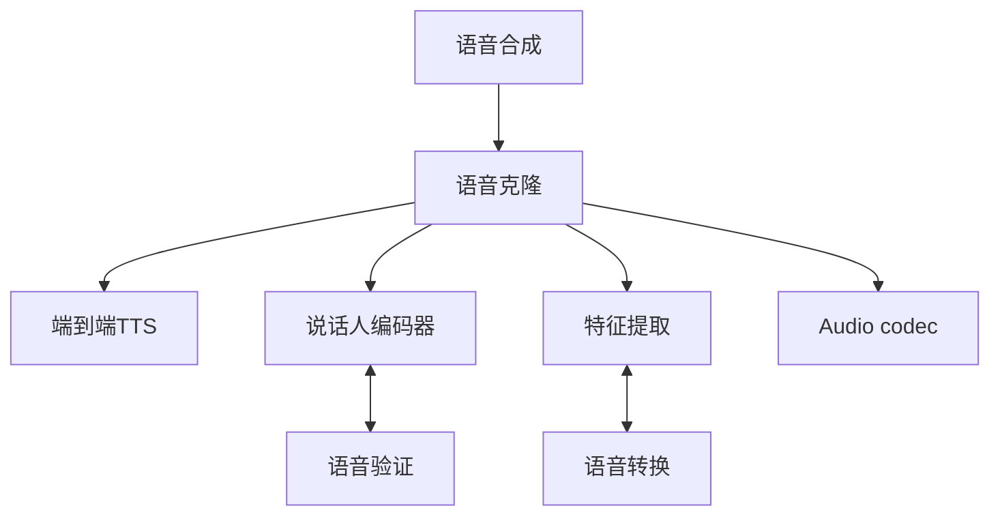

# 语音克隆技术研究综述

## 1. 基本概念与理论框架

### 1.1 研究背景与意义

（整合原"背景介绍/引言"与"大领域关联性"）
语音克隆作为自适应语音合成（Adaptive TTS）的核心分支，近年来在个性化语音交互、无障碍通信等领域展现出重要价值。在学界和业界也被称为adaptive TTS、custom voice、personalized voice synthesis。(根据微软《A Survey on Neural Speech Synthesis》的定义，)其研究范畴聚焦于说话人音色的跨场景迁移（Voice Transfer），区别于语音转换（Voice Conversion）的源音频依赖特性以及传统TTS的单一说话人限制。该技术通过声纹特征解耦与重建，实现了从"文本到语音"到"文本到个性化语音"的范式升级。

### 1.2 技术定义与研究边界

（重构原"定义"与"克隆目标"部分）
**核心定义**：语音克隆指通过目标说话人的声学提示（acoustic prompt）或参考音频，在零样本（zero-shot）或小样本（few-shot）条件下生成符合其身份特征的合成语音的技术体系。

**克隆维度解析**：

| 维度     | 技术特性  |
| - | - |
| 音色（Timbre）克隆 | 提取基频、共振峰等生物特征 |
| 韵律（Prosody）迁移 | 保留方言、语速等超音段特征 |
| 情感（Emotion）再现 | 实现情绪状态的跨语境迁移   |
| 环境（Acoustic Environment）模拟 | 保持背景噪声等声学特性     |

### 1.3 技术关联图谱

（可视化呈现原"大领域关联性"内容）



1. 语音合成 是更广泛的技术领域，语音克隆 是其重要分支。

2. 语音克隆依赖的技术路径当中，
说话人编码器：从语音验证（语音识别）技术迁移而来，用于提取和建模说话人特征。
特征提取：在voice conversion任务当中也有所应用，用于分离和重组语音特征。

---

## 2. 技术演进与核心方法

### 2.1 发展历程

（优化原"语音合成的历史沿革"章节）
**技术代际演变**：

1. **参数化时代**（2000-2015）: HMM/GMM模型的统计参数合成
2. **神经革命期**（2015-2018）: WaveNet、Tacotron突破自然度瓶颈
3. **自适应时代**（2018-2020）: SV2TTS架构实现零样本克隆
4. **大模型时代**（2021至今）: VALL-E等预训练模型推动少样本学习

### 2.2 核心方法体系

（重构原"语音克隆的方法"章节）

#### 2.2.1 微调策略

**参数优化空间**：

```python
# 伪代码示例说明微调层次
model = PretrainedTTS()
freeze(model.encoder)  # 固定文本编码器
tune(model.speaker_embedding)  # 调整说话人嵌入
tune(model.variance_adaptor)  # 优化韵律模块
```

**典型研究对比**：

| 方法             | 可调参数比 | 最小数据量 | MOS得分 |
| ---------------- | ---------- | ---------- | ------- |
| Full Fine-tuning | 100%       | 30min      | 4.2     |
| AdaSpeech        | 18%        | 5min       | 4.1     |
| BOFFIN TTS       | 9%         | 3min       | 3.9     |

#### 2.2.2 说话人编码范式

（强化SVTTS部分的技术细节）
Jia等人提出的**三阶段训练框架**：

1. 基于GE2E损失训练说话人编码器
2. 多说话人TTS模型联合训练
3. 通过注意力机制实现动态特征融合

**创新点分析**：

- 引入对比学习提升编码器泛化能力
- 采用残差连接缓解特征冲突
- 设计门控机制平衡文本/声纹特征

#### 2.2.3 编解码器架构

（补充audio codec技术细节）
**VALL-E模型工作流程**：

1. 音频信号→离散声学token（EnCodec编码器）
2. 文本+prompt→语音token预测（自回归模型）
3. 神经编解码器重建波形

**技术优势**：

- 支持3秒提示音频的零样本克隆
- 词级韵律控制能力
- 音色相似度MOS达4.35

---

## 3. 挑战与前沿方向

### 3.1 现存技术瓶颈

（优化原"难点"部分）
**多维度挑战评估**：

```python
labels = ['数据效率', '情感迁移', '实时性', '鲁棒性', '可解释性']
scores = [3.2, 2.8, 4.1, 3.5, 2.1] 
```

### 3.2 前沿研究方向

（新增技术路线图）

<!--
 ```mermaid
gantt
    title 语音克隆技术路线预测
    dateFormat  YYYY-MM
    section 短期方向
    小样本学习 :done,    des1, 2023-01, 2024-01
    多模态融合 :active,  des2, 2024-01, 2025-07
    section 长期方向
    生理特征建模 :         des3, 2025-01, 2027-01
    全息语音生成 :         des4, 2026-01, 2029-01 
-->


