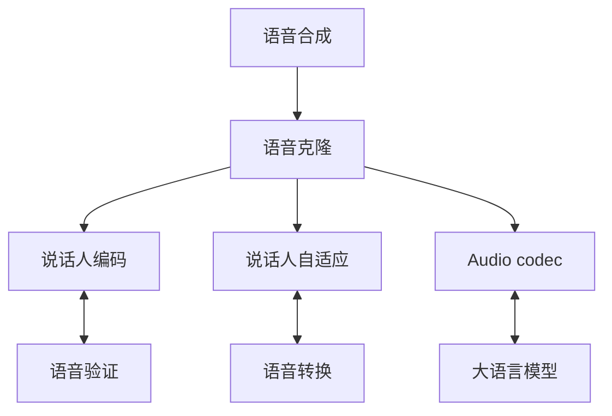

# 语音克隆技术研究综述

## 1. 基本概念与理论框架

*XXXXXXXXXXXXXXXXXXXXXXXXXXXXXXXXXXXXXXXXXXXXXXXXXXXXXXXXXXXXXXXXXXXXXXXXXXXXXXXXXXXXXXXXXXXX等待施工XXXXXXXXXXXXXXXXXXXXXXXXXXXXXXX*

### 1.1 研究背景与意义

（整合原"背景介绍/引言"与"大领域关联性"）
语音克隆作为自适应语音合成（Adaptive TTS）的核心分支[微软, A Survey on Neural Speech Synthesis]，近年来在个性化语音交互、无障碍通信等领域展现出重要价值。在学界和业界也被称为adaptive TTS、custom voice、personalized voice synthesis。(根据微软《A Survey on Neural Speech Synthesis》的定义，)其研究范畴聚焦于说话人音色的跨场景迁移（Voice Transfer），区别于语音转换（Voice Conversion）的源音频依赖特性以及传统TTS的单一说话人限制。该技术通过声纹特征解耦与重建，实现了从"文本到语音"到"文本到个性化语音"的范式升级。

### 1.2 技术定义与研究边界

（重构原"定义"与"克隆目标"部分）
**核心定义**：语音克隆指通过目标说话人的声学提示（acoustic prompt）或参考音频，在零样本（zero-shot）或小样本（few-shot）条件下生成符合其身份特征的合成语音的技术体系。

**克隆维度解析**：

| 维度                             | 技术特性                   |
| -------------------------------- | -------------------------- |
| 音色（Timbre）克隆               | 提取基频、共振峰等生物特征 |
| 韵律（Prosody）迁移              | 保留方言、语速等超音段特征 |
| 情感（Emotion）再现              | 实现情绪状态的跨语境迁移   |
| 环境（Acoustic Environment）模拟 | 保持背景噪声等声学特性     |

### 1.3 技术关联图谱

（可视化呈现原"大领域关联性"内容）



1. 语音合成 是更广泛的技术领域，语音克隆 是其重要分支。

2. 语音克隆依赖的技术路径当中，
说话人编码器：从语音验证（语音识别）技术迁移而来，用于提取和建模说话人特征。
特征提取：在voice conversion任务当中也有所应用，用于分离和重组语音特征。

---

## 2. 技术演进与核心方法

### 2.1 发展历程

（优化原"语音合成的历史沿革"章节）
**技术代际演变**：

1. **参数化时代**（2000-2015）: HMM/GMM模型的统计参数合成
2. **神经革命期**（2015-2018）: WaveNet、Tacotron突破自然度瓶颈
3. **自适应时代**（2018-2020）: SV2TTS架构实现零样本克隆
4. **大模型时代**（2021至今）: VALL-E等预训练模型推动少样本学习

### 2.2 核心框架

在语音克隆时，往往没有显式的数据标签可用，或者打标通常会导致大量的人力，不能覆盖特定的或细粒度的变化信息[Neural Voice Cloning with a Few Samples]。因此，我们可以从数据中隐式地建模变异信息。各种处理方法如下：


#### 2.2.1 说话人自适应（Speaker Adaptation）框架

这类框架的核心思想是通过对预训练模型的部分或全部参数进行微调，使其适应目标说话人的声音特征[A Survey on Neural Speech Synthesis]。尽管传统的说话人自适应方法可能需要大量的微调步骤，但通过引入元学习算法如MAML，可以显著减少所需的微调步骤，从而提高效率和适用性。

**典型方法**：

- Full Fine-tuning：对整个模型进行微调。
- AdaSpeech：加入层归一化，仅调整部分模块（如韵律模块）的参数[AdaSpeech: Adaptive Text to Speech for Custom Voice]。
- Meta-TTS：使用MAML等元学习算法找到一个优秀的初始化点，使得模型能快速适应新说话人。

**自监督学习（SSL）**：

- Self-Supervised Learning（自监督学习）：如wav2vec、HuBERT等模型通过自监督学习从音频中提取高层次的表征，这种技术可以应用于说话人编码框架以替代传统的speaker embeddings提取步骤。

#### 2.2.2 说话人编码（Speaker Encoding）框架

将注册话语编码为说话人嵌入（speaker embedding）[Transfer Learning from Speaker Verification to Multispeaker Text-To-Speech Synthesis]。训练好的TTS模型可以根据相应的说话人嵌入生成用户的语音。然而，这种方法面临的一个挑战是从已见说话人推广到未见说话人的泛化差距问题。

**特点**：

- 不需要对模型进行参数更新，只需在推理阶段输入目标说话人的特征向量。
- 数据需求较低，通常只需要几秒钟的目标说话人音频。
- 对模型的泛化能力要求较高。

**典型代表**：

1. SV-TTS：结合GE2E损失训练说话人编码器[Transfer Learning from Speaker Verification to Multispeaker Text-To-Speech Synthesis]，并将speaker embeddings输入到多说话人TTS模型中。
   - **三阶段训练框架**：
     1. 基于GE2E损失训练说话人编码器。
     2. 多说话人TTS模型联合训练。
     3. 通过注意力机制实现动态特征融合。
   - **创新点**：
     - 引入对比学习提升编码器泛化能力。
     - 采用残差连接缓解特征冲突。
     - 设计门控机制平衡文本/声纹特征。

2. VITS：通过变分推断和GAN结构生成高质量语音[A Voice Cloning Method Based on the Improved HiFi-GAN Model]，支持speaker embeddings输入。
   - **VITS概述**：
     - VITS（Variational Inference Text-to-Speech）是一种基于变分推理的端到端语音合成模型。它通过联合训练文本编码器、变分自编码器（VAE）和生成对抗网络（GAN）来实现高质量的语音合成。
   - **VITS在语音克隆中的应用**：
     - VITS模型通过引入说话人嵌入（speaker embeddings）来实现语音克隆。具体方法包括：
       1. **说话人嵌入**：VITS模型使用预训练的说话人编码器提取目标说话人的声纹特征，并将其作为条件输入到模型中。
       2. **变分推理**：通过VAE对语音特征进行建模，捕捉语音的多样性和复杂性。
       3. **对抗训练**：通过GAN提升生成语音的自然度和真实感。
   - **技术优势**：
     - 支持高质量的语音合成，音色相似度高。
     - 通过变分推理和对抗训练，生成语音的自然度和多样性得到显著提升。
     - 结合说话人嵌入，实现个性化语音合成。

#### 2.2.3 编解码器架构

这类框架的核心思想是通过尽可能多地利用大规模、多样化的数据集来训练模型[Neural Codec Language Models are Zero-Shot Text to Speech Synthesizers]，从而让模型具备强大的泛化能力和上下文学习能力。这种方法避免了设计复杂的特定网络结构，而是依赖于大数据带来的自然规律学习。

**VALL-E**：

基于大语言模型的成功经验，通过训练包含大量多样化数据的大规模模型来实现零样本或多样本的高质量语音合成[Wang et al., Neural codec language models are zero-shot text to speech synthesizers, 2023]。

**VALL-E模型工作流程**：

1. **音频编码**：使用EnCodec编码器将音频信号转换为离散声学token。
2. **语音生成**：通过自回归模型将文本和提示音频（prompt）转换为语音token。
3. **音频解码**：使用神经编解码器将语音token重建为语音波形。

**技术优势**：

- 支持3秒提示音频的零样本克隆。
- 词级韵律控制能力。
- 音色相似度MOS达4.35。

**VALL-E在语音克隆中的应用**：

VALL-E模型通过结合文本和提示音频，实现高质量的个性化语音合成。具体方法包括：

1. **提示音频**：使用目标说话人的提示音频作为条件输入。
2. **自回归生成**：通过自回归模型生成符合目标说话人特征的语音token。
3. **音频重建**：通过神经编解码器将语音token重建为语音波形。

### 2.3 技术改进

#### 2.3.1 元学习策略

**元学习概述**：

元学习（Meta-Learning）是一种通过学习如何学习来提升模型在新任务上的快速适应能力的方法。其核心思想是通过在大量不同任务上的训练，使模型能够在少量样本的情况下快速泛化到新任务。

**应用于语音克隆**：

在语音克隆中，元学习可以用于提升模型在少样本条件下的语音合成效果。具体方法包括：

1. **基于模型的元学习**：通过训练一个元模型，使其能够快速调整参数以适应新说话人的语音特征。
2. **基于优化的元学习**：通过优化算法（如MAML）使模型能够在少量梯度更新后快速适应新任务。
3. **基于记忆的元学习**：通过记忆网络存储不同说话人的特征，使模型能够快速检索并生成相应的语音。

#### 2.3.2 GAN

**GAN（Generative Adversarial Networks）**：

在VITS中使用的GAN声码器能够生成接近真实语音的高质量波形[A Voice Cloning Method Based on the Improved HiFi-GAN Model]，适用于所有需要高保真度输出的框架。

**典型代表**：

- HiFi-GAN：一种高保真度的GAN声码器，能够生成高质量的语音波形。

#### 2.3.3 VAE

**VAE（Variational Autoencoder）**：

在VITS中被用来捕捉文本韵律并通过Flow重建音频细节，增强了模型表达能力，有助于改善合成语音的自然度。

**典型代表**：

- VITS：通过VAE捕捉文本韵律，并通过Flow重建音频细节。

## 3. 挑战与前沿方向

### 3.1 现存技术瓶颈

（优化原"难点"部分）
**多维度挑战评估**：

```python
labels = ['数据效率', '情感迁移', '实时性', '鲁棒性', '可解释性']
scores = [3.2, 2.8, 4.1, 3.5, 2.1] 
```

### 3.2 前沿研究方向

（新增技术路线图）

### 3.2.1 在传统的语音克隆中加入嵌入情感

典型例子-V2C

**V2C的组成**

1.V2C-Net
    i. Multi-model encoder多模型编码器：
        - Text encoder：
        - Speaker encoder：
        - Emotion encoder：将输入的reference video转化成emotion embeddings
    ii. Synthesiser
        - Duration predictor：
        - Pitch predictor：
        - Energy predictor：
    iii. Vocoder：运用HIFI-GANs

2.构建V2C-Animation Dataset
    i.Data collection:
    ii.Data annotation and organisation:
        - 参考Librispeech和FER-2013分别对于英语语音和面部表情的分类，V2C-Animation Dataset把处理过的视频和字幕信息归于8个门类。
        - 将所有收集的数据分为training data，validation data和testing data。

3.评价指标的设定（MCD-DTW-SL）
    i.客观评价指标
    <此处添加一个表格>
    ii.主观评价指标
    iii.定量与定性评价

**VC与V2C的比较以及创新点分析**

1. **Prosody Transfer** 从原本的Tacotron模型展开延伸，加入韵律的捕捉。在传统VAE框架的基础上，运用Global Style Tokens（GST）设计了一个神经序列到序列的文本到语音合成模型。
2. **再次加入reference audio and video**相比于为加入的样本而言，在identity accuracy和emotion accuracy方面有显著优势。
3. **输入中影视材料的处理**
4. **emotion维度的嵌入**

**技术应用**

- 影视配音

**未来的优化方向**

- 设计一个emotion aware loss去捕捉更微小的表情信息
- 设计更简便的融合体系（ie. COOT,VATT需要<reference>)，使整个模型的运用更有效率

（新增技术路线图）

<!--
 ```mermaid
gantt
    title 语音克隆技术路线预测
    dateFormat  YYYY-MM
    section 短期方向
    小样本学习 :done,    des1, 2023-01, 2024-01
    多模态融合 :active,  des2, 2024-01, 2025-07
    section 长期方向
    生理特征建模 :         des3, 2025-01, 2027-01
    全息语音生成 :         des4, 2026-01, 2029-01 
-->


